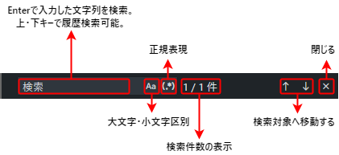

Wails in-page search library.
===
Wailsアプリで、ページ内検索機能を実装するためのライブラリです。

## 機能・外観
次の機能を提供します:

1. ショートカットキーで検索バーの表示・非表示を制御
2. 正規表現検索
3. 大文字・小文字、かな・カナを区別して検索
4. 検索履歴から過去の検索を探す(100件分)
5. 検索した文字列が分かりやすくなるように目印を付与
6. 検索結果件数の表示
7. 検索対象へ次へボタン、前へボタンで移動する

検索バーに関しては、次のような画面になります。 


※デザインが思いつかなかったので、見た目をVSCodeそっくりにしました。

### できないこと
以下の検索はできない点に注意すること。

* input タグが持つ、 `value` の中身を検索
* img タグの `alt` メッセージの中身を検索
* CSS の `content: "~"` に指定した文字列の検索

## デモ
CodePen にデモ用の画面を用意しました。以下URLから、操作を確認できます。

 * https://codepen.io/ochipin/pen/zYybqrV

Ctrl + Fで検索バーが出るので、試しに操作してみてください。

## Getting Started

### インストール

```
$ git clone github.com/ochipin/wails-find-in-page.git
```

### 使用方法
```html
<!-- 検索バー 詳しくは sample.html 参照 -->
<div id='search' class="search" style="right: 12px; left: auto; top: 0">...</div>

<div id="sample">
  <div>
    <dom>... ここのコンテンツが検索対象になる ...</dom>
  </div>
</div>

...
<!-- 検索ライブラリを読み込み -->
<script src="javascripts/search.js"></script>
<script>
/* 検索機能を各種イベントリスナーに登録する */
document.addEventListener("DOMContentLoaded",() => {
    /** 検索クラスから、インスタンスを生成する */
    const search = new Search({
        // 検索対象となるエレメントを渡す(※この例ではid="sample"のdivエレメントを渡している)
        target: document.querySelector("#sample"),
        scroll: document.documentElement,
        // shortcut: (evt) => {
        //     ... ショートカットキーの登録を変更することもできる
        // }
    });
    // リサイズイベントに対応する
    document.body.onresize = () => {
        search.resize();
    }
    // ショートカットキーを登録する
    addEventListener("keydown", (evt) => {
        search.shortcut(evt);
    });
});
</script>
```
※詳細は`sample.html`を参照してください。

## License

"Wails in-page search library" is under [MIT License](https://en.wikipedia.org/wiki/MIT_License).

## Author

Suguru Ochiai - [X](https://twitter.com/ochipin3) - suguru.ochiai.doc@gmail.com
